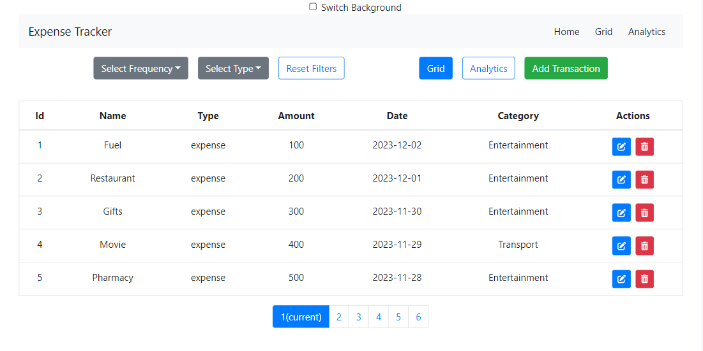
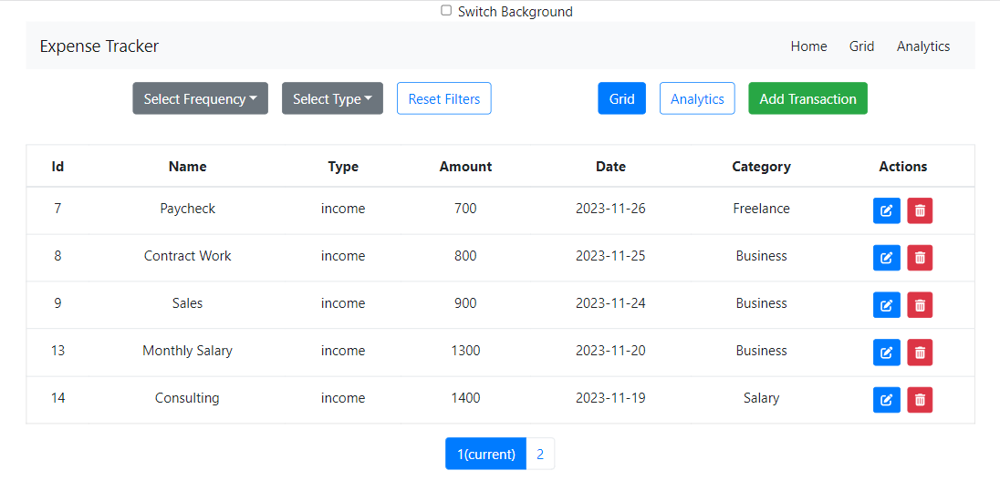
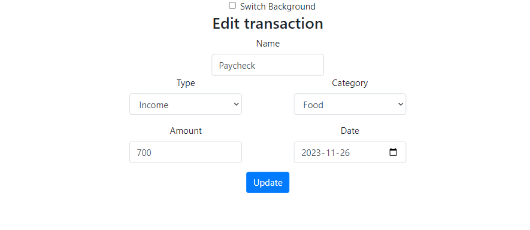
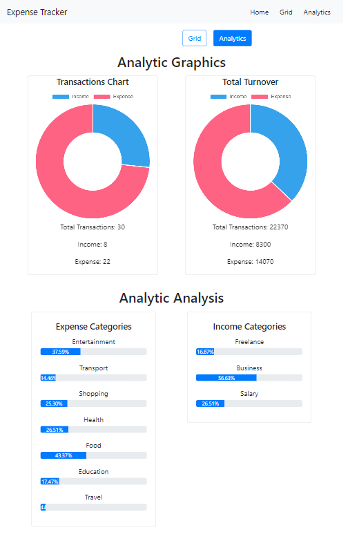

# Expense Tracker

## Project Description

This project includes an expense tracking application used to monitor income and expenditures. It is a modern web application developed using React.

## Technologies and Libraries Used

- React Vite
- React Redux / Redux-Tools
- React Router
- Bootstrap@4.6
- Chart.js
- ...

## Project Structure

- `src/components`: Contains application components.
- `src/redux`: Includes Redux actions, reducers, and the store.
- `src/styles`: Contains style files.
- ...

## Used React Hooks

- `useState`
- `useEffect`
- `useSelector`
- ...

## How to Run

1. Open the terminal in the project directory.
2. Run the `npm install` command to install dependencies.
3. Start the application with the `npm run dev` command.

## Acknowledgments

This project is part of the Technigo Bootcamp and serves as the final project. Special thanks to Antonella and the entire Technigo team for their support and guidance throughout the bootcamp.

## Deployed Link

https://technigo-final-week-project.netlify.app/
